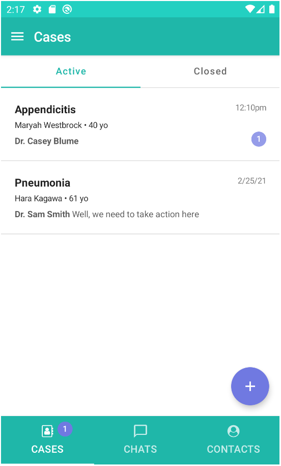

# PubNub DrChat

[](https://travis-ci.com/pubnub/kotlin-telemedicine-demo)

The DrChat app demonstrates how to build a feature-rich chat and team collaboration application
using [PubNub Chat](https://www.pubnub.com/docs/chat/quickstart). Learn how to manage users, join
chat rooms, and send messages with PubNub. Learn how to build advanced features like profanity
filtering, gifs, and link previews. You can download the project to run on your local machine, and
explore the code to see how we built it.


 |  |  |
--- | ---- | ---- |

The application demonstrates how to build a chat application using:

- PubNub
- Kotlin
- Jetpack Compose
- Coroutines

## Features

- 1:1 and group messaging,
- Fetching history of missed messages,
- Encrypted messages and database,
- Offline / online presence indicator,
- Typing indicator,
- Message receipts,
- File sharing.


## Requirements

- [Node.js](https://nodejs.org/en/)
- [PubNub Account](https://dashboard.pubnub.com/)
- [Android Studio Canary 8](https://developer.android.com/studio/preview)

## Running the project

1. Clone the GitHub repository.

    ```bash
    git clone https://github.com/pubnub/kotlin-telemedicine-demo.git
    ```

1. Install the project to initialize data.

    ```bash
    cd kotlin-telemedicine-demo/setup
    npm install
    ```

1. Start the initialization. You'll be asked to enter your publish and subscribe keys from
   the [PubNub Dashboard](https://dashboard.pubnub.com/). Note that
   Files should be enabled and a region should be selected on the key. 
   You can also optional pass a cipher key to enable message encryption.

    ```bash
    npm start
    ```

1. Start Android Studio and open a project. Please connect your Android phone or start an emulator
   and run application with default settings.

## Changing properties

You can change publish, subscribe and cipher key manually. To do it, please edit a [gradle.properties](./gradle.properties) 
file.
